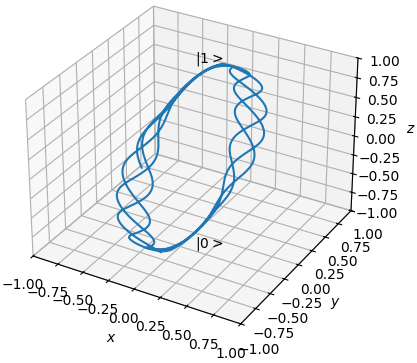

# Lielab

Software for the geometric modeling and numerical analysis of systems, especially those in relation to Lie theory.

  - Domain: Lie algebras, Lie groups, and smooth manifolds.
  - Functions: Various transformations and operations on domains, exponential coordinates, Cayley transform, etc.
  - Integrate: Computation of Initial Value Problems (IVPs).
  - Utils: Miscellanious tools and functions not entirely related. Likely to be removed.

This project is not complete.

## Getting started

### Installation

Easiest way to install is via a package manager

| Manager | Install                                  | Latest version |
|---------|------------------------------------------|----------------|
| pip     | `pip install lielab`                     | [](https://pypi.org/project/lielab/) |
| Conan   | `conan install --requires=lielab/[*]`    | [](https://conan.io/center/recipes/lielab) |

Then import into a project with

| Language | Import                  |
|----------|-------------------------|
| Python   | `import lielab`         |
| C++20    | `#include <Lielab.hpp>` |

### Quick Example (Python)

A short example in the simulation of the time dependent Schrodinger equation for a closed two-level quantum system on $\mathbb{C}^2$. Import Lielab and construct the usual Pauli matrices.

```python
from lielab.domain import su, CN, CompositeAlgebra, CompositeManifold
from lielab.integrate import solve_ivp, IVPOptions, HomogeneousIVPSystem
import numpy as np

sigma_x = -1j*su.basis(0, 2)
sigma_y =  1j*su.basis(1, 2)
sigma_z = -1j*su.basis(2, 2)
```

Create a helper function to generate the expectation values of $\ket{\psi}$

```python
def expectation(y):
    psibar = y[0].to_complex_vector()
    ex = np.real(np.dot(np.dot(psibar.conj(), sigma_x.get_matrix()), psibar))
    ey = np.real(np.dot(np.dot(psibar.conj(), sigma_y.get_matrix()), psibar))
    ez = np.real(np.dot(np.dot(psibar.conj(), sigma_z.get_matrix()), psibar))
    return [ex, ey, ez]
```

Create two functions evaluating the time dependent Schrodinger equation, $d/dt \ket{\psi} = -j H \ket{\psi}$, with time and state dependent Hamiltonian $H = \sigma_x + \cos(4 \pi t) |E_1(\ket{\psi})| \sigma_z$

```python
def Schrodinger_generator(t, y):
    ex = expectation(y)
    const_drift = sigma_x
    nonconst_drift = 1*np.cos(4*np.pi*t)*np.abs(ex[1])*sigma_z
    hamiltonian = const_drift + nonconst_drift
    return CompositeAlgebra([-1j*hamiltonian])

def Schrodinger_action(g, y):
    next_psibar = np.dot(g[0].get_matrix(), y[0].to_complex_vector())
    return CompositeManifold([CN.from_complex_vector(next_psibar)])
```

Set initial condition $\ket{\psi(0)} = \ket{1}$ and simulate for $t \in [0, 10]$. Postprocess the expectation values from the result.

```python
psi0 = CompositeManifold([CN.from_complex_vector([1, 0])])

Schrodinger_equation = HomogeneousIVPSystem(Schrodinger_generator, action=Schrodinger_action)

options = IVPOptions()
options.dt_max = 0.01

path = solve_ivp(Schrodinger_equation, [0, 10], psi0, options)

ebar = np.vstack([expectation(yi) for yi in path.y])
```

Plot the result on the Bloch sphere

```python
import matplotlib.pyplot as plt
fig = plt.figure()
ax = fig.add_subplot(projection='3d')
ax.plot(ebar[:,0], ebar[:,1], ebar[:,2])
ax.text(0, 0, 1.2, r'$|1>$')
ax.text(0, 0, -1.2, r'$|0>$')
ax.set_xlabel(r'$x$')
ax.set_ylabel(r'$y$')
ax.set_zlabel(r'$z$')
ax.set_xlim([-1,1])
ax.set_ylim([-1,1])
ax.set_zlim([-1,1])
plt.show()
```



### Documentation

tbd...

## Other Notes

### Expressiveness

While Lielab uses a C++ backend, it's intent is **not** as a high performance code.

### Contributing

Suggestions, feedback, helpful tips, or pseudocode can be submitted via the issues tracker.

Pull requests, commits, and other contributions with hard code are not accepted at this time. Sorry.

## Citation

```
@misc{Lielab,
  author = {Sparapany, Michael J.},
  title = {Lielab: Numerical Lie-theory in C++ and Python},
  year = {2024},
  publisher = {GitHub},
  journal = {GitHub repository},
  howpublished = {\url{https://github.com/sandialabs/lielab}}
}
```
